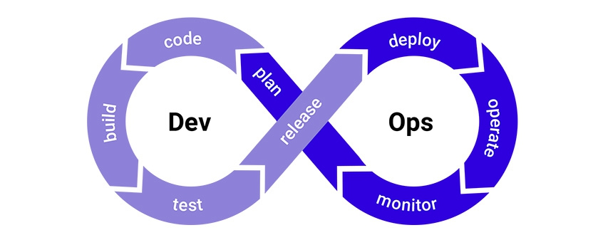
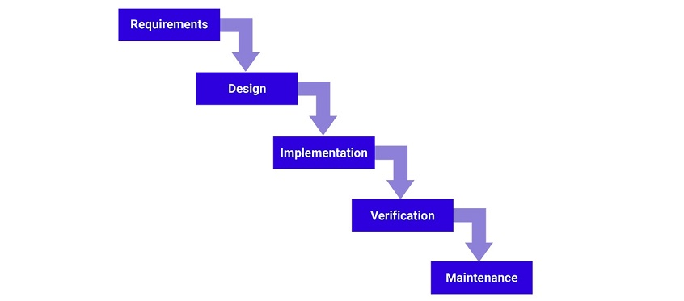
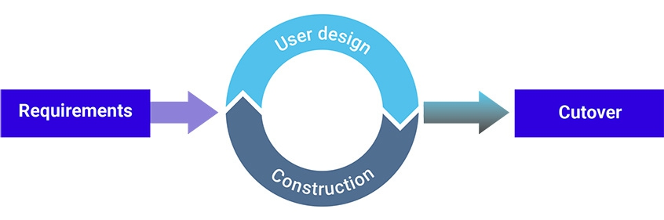

## *3 Contoh MPPL yang mewakili klasik dan Agile*

### DevOps
DevOps merupakan singkatan dari dua kata yaitu Development dan Operation. Di mana kedua kata tersebut bermakna “operasional pengembang”. Seperti yang disebutkan sebelumnya, DevOps adalah sebuah prinsip developer untuk mengkoordinasikan antar tim yaitu tim development dengan tim operations dengan efektif dan efisien

### Waterfall
Metode waterfall adalah metode kerja yang menekankan fase-fase yang berurutan dan sistematis. Disebut waterfall karena proses mengalir satu arah “ke bawah” seperti air terjun. Metode waterfall ini harus dilakukan secara berurutan sesuai dengan tahap yang ada.

### Rapid application development (RAD)
Rapid application development (RAD) adalah metode yang berfokus pada pengembangan aplikasi secara cepat, melalui pengulangan dan feedback berulang-ulang.

